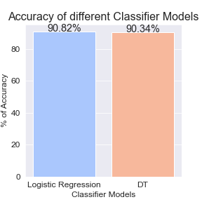
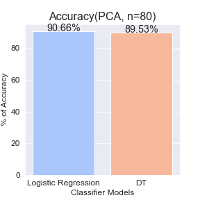

## IAI-classification

#### *TODO-1*  Feature-Engineering

本部分我采用了$PCA$的方法进行特征选取。

我先用`numpy`实现了一个$PCA$，然后于sklearn实现的$PCA$进行比较，取$n = 80$, 两者训练的正确率在平均意义上一致，验证了算法的正确性。

再比较使用PCA前后对LR、DT两个模型正确率的影响(左图为未使用PCA)。

使用PCA前：

<figure class="half">

    

</figure>

使用PCA后(5次平均)：

<figure class="half"> 
 
 </figure>

发现私用PCA后DT的准确率下降了，LR的准确率无变化。

对此数据而言，PCA并不能提高训练准确度。

#### *TODO-2 Train*
