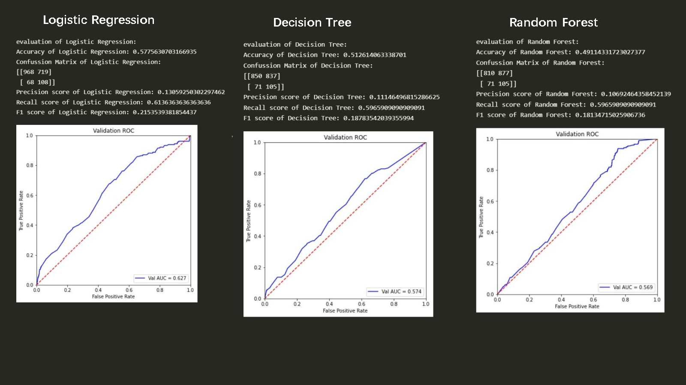
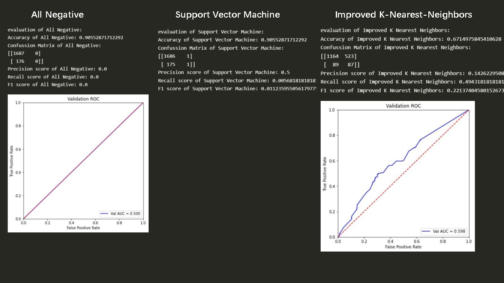
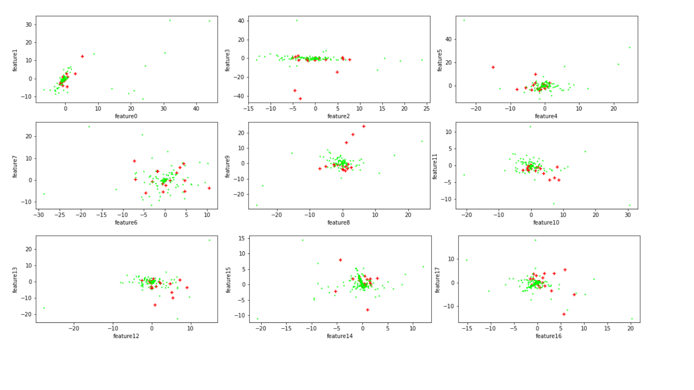
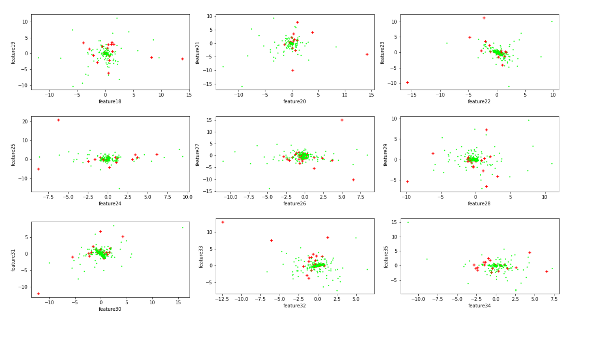
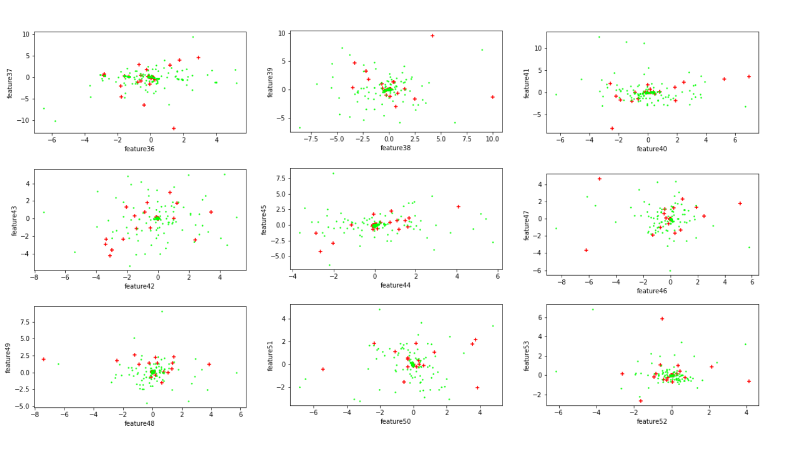
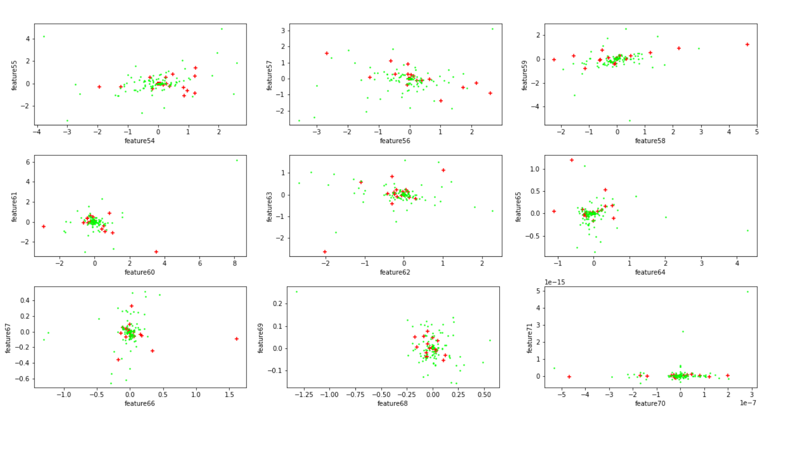
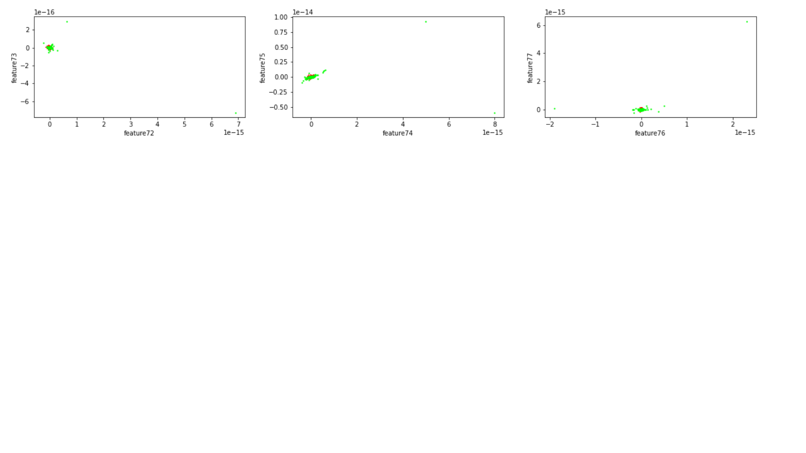

## IAI-classification

### TODO-2,3: Train, Tune and Evaluate Model

观察到数据的正负例非常不均匀，我先写了一个“全阴性”分类器(AN)，对所有样本都判断为阴性，AN分类器在训练集3781个样本上的正确率有$90.55\%$，也就是负例（阴性）和正例（阳性）的比例竟然达到了9.58的比例，这对于很多分类算法是非常不利的，因为很多分类算法都是基于各个类别出现的概率均匀分布。

我先测试了几种基础的分类算法, Logistics Regression(LG)，Decision Tree (DT)，Kernel SVM（KSVM), Random Forest(RF),  improved K-Nearest-Neighbors(MyKNN,改良knn）

其中KNN是我自己实现的，先对样本点进行去除重复点操作，并采用kd-tree存储样本点集来降低查询复杂度，计算概率时使用距离反比加权，并对样本种类进行加权，以减小正负例的差异，具体计算点$v_i$为正例的概率采用的公式是：$p(y_i=1 )=\frac{\sum_{ X_j,y_j \in S,y_j=1} w y_j /dist(X_i, X_j)  }{\sum_{\forall X,y \in S} (1+(w-1)I[y=1]) y /dist(X_i, X)}$

其中$Y$为训练集合的label，dist为两点的平方距离。

经过简单测试，我发现这些模型的正确率都 不如AN分类器，特别是Gussian Naive Bayes分类器基本完全失效。我意识到单纯用正确率评价模型是无意义的，因为在样本中负例对正例的影响太大了。结合TODO-3的提示，我写了一个评估模型函数，它主要评估模型的指标有**Accuracy, Precision, Recall, Confussion Matrix, F1-Score，ROC曲线和AUC值**，对每个模型，相对于正确率，我们更看重他的recall，因为我们比较关注真阳性样本中有多少样本能被预测出来。

为了得到比较好的参数，我采用交叉验证的方式进行调参，调整的参数主要是class_weight。选取的指标是交叉验证平均正确率大于50%时的recall——我们调整分类器的参数，让它们的recall达到最大值且正确率不低于50%。

实验对上述模型进行调参，发现这些模型f1-score达到极大值的时候，正确率会出奇的低，原因在于如果要多考虑阳性样本，阴性样本的正确率就会降低，导致总正确率非常低，为了能评估模型，我界定了一个范围，就是验证正确率不低于70%的条件下进行选取。

对LR，DT， KSVM，RF，MyKNN 五种模型通过测试集合进行评估。

测试结果如下：

从上述结果可以看出效果比较好的模型有逻辑回归和KNN等，前者在保证正确率的情况下有较高的Recall，后者在保证Recall的情况下有较高的正确率。

#### 尝试：过采样和欠采样

为了解决正负例不均匀的问题，我还采用了过采样和欠采样对样本进行处理。

过采样：在训练集，我将原有的正例随机复制扩充达到和负例一样的规模，使得正负例在训练集中较均匀分布。但实际训练的效果并不好。

欠采样：我尝试将负例随机取样到和正例一样的规模，但由于训练集缺失过多，训练效果反而更差了。非常令人绝望。

#### 思考：模型的可分性

可以看出，最终几种模型的评估结果都不是很好，我尝试了很多种改进方式，都并不能达到可观的结果。于是，绝望的我决定从特征集入手，我决定把特征处理过的点用多图画出来。

该图绿色的点表示的负例子，红色的‘+’形点代表的是正例，这里为了让正例更加明显，我调大了正例点的大小。可以看出，在各个特征维度，正负例的中心点都是接近的，很难将它们较好的分离，我们模型能够保证较好的Recall就比较不错了。

### TODO-1 Feature Engineering

对原始特征的处理我主要采用了$PCA$技术，在学习基本原理后我用numpy实现了PCA的完整过程，并且与sklearn的库进行比较，证明了自己实现过程的正确性。

本部分我主要采用了四种特征选取：

- 原始数据`dataset_raw`

- 删除强相关性的列`dataset_rm`

- 删除强相关性的列后标准化`dataset_rm_std`

- 删除强相关性的列后进行PCA `dataset_rm_pca`，取映射维度为60

我们使用逻辑回归和决策树对四中数据集进行评估, 评价指标为正确率和Recall(超参数采样第二、三部分选取出的参数)。

| （Acc, Recall) | `dataset_raw` | `dataset_rm`  | `dataset_rm_std` | `dataset_rm_pca` |
| ------------- | ------------- | ------------- | ---------------- | ---------------- |
| LR            | (0.567,0.653) | (0.572,0.642) | (0.578,0.614)    | (0.578,0.614)    |
| DT            | (0.526,0.619) | (0.509,0.619) | (0.514,0.618)    | (0.510,0.597)    |

可以看出删除强相关数据后数据正确率有所提升，但采用PCA后各个模型并无明显的变化，说明数据的特征维度并不具有压缩性。

### TODO-4: Predict other labels

此部分完成在`predict_task.ipynb`，我选取的label为`patient_addmited_to_regular_ward_(1=yes,_0=no)`。
